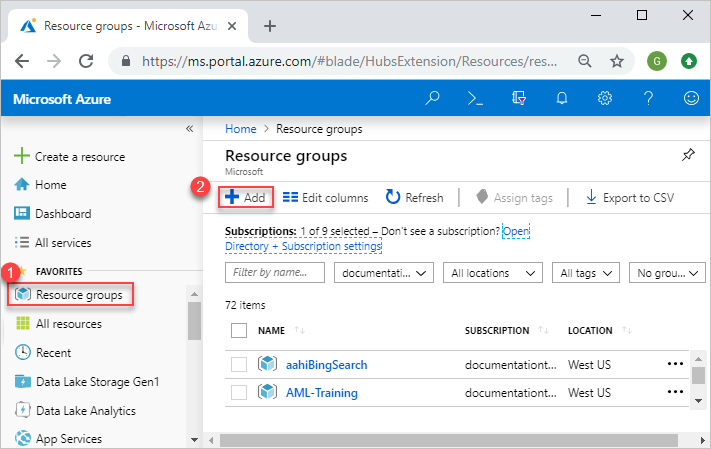
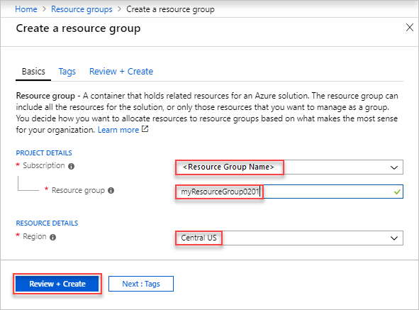

# Azure Treinamento (Aula 01 - Azure Basics Services)
Nesta aula vamos apenas criar um resource group via Portal do Azure e tambem vamos ver como criar via Azure CLI

## O que é um grupo de recursos?
Um grupo de recursos é um contêiner que mantém os recursos relacionados a uma solução do Azure. O grupo de recursos pode incluir todos os recursos para a solução ou apenas os recursos que você deseja gerenciar como um grupo. Você decide como deseja alocar recursos para grupos de recursos com base no que faz mais sentido para sua organização... [Azure Docs](https://docs.microsoft.com/pt-br/azure/azure-resource-manager/management/manage-resource-groups-portal)

## Azure Portal

1. Acessar Portal do Azure https://portal.azure.com/#home

2. Selecione Resource Groups

    

3. Clique em adicionar (+Add)

4. Insira os valores na imagem abaixo
    * **Assinatura:** Selecione sua assinatura do Azure.

    * **Grupo de recursos:** insira um nome para o novo grupo de recursos.

    * **Região:** selecione uma localização do Azure (Region).

    

5. Clique em Review + Create

## Azure CLI

Gerenciar grupos de recursos e implantações de modelo... [Azure Docs](https://docs.microsoft.com/pt-br/cli/azure/group?view=azure-cli-latest#az-group-create)

1. Criar Resource Group
    > az group create -l brazilsouth -n cloudtreinamentos

2. Deletar Resource Group
    > az group delete -n cloudtreinamentos

3. Listar Resource Group
    > az group list